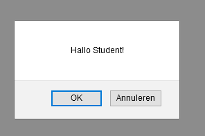
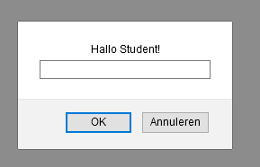

# FRONTEND-BASIC

## Opdracht 10 - Popup boxen

### OPDRACHT

1. Open `index.html` in je browser.
2. Verander de alert-box naar confirm()
3. Verander de alert-box naar prompt()
4. Check je antwoorden met het resultaat

### RESULTAAT

