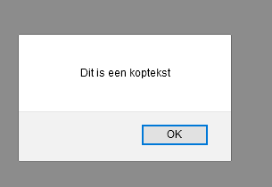

# FRONTEND-BASIC

## Opdracht 13 - querySelector

### OPDRACHT

1. Open `index.html` in je browser.
2. Wat zie je?
3. Bestudeer de code eens. Je ziet dat het element `<h1>` is opgehaald
4. Je ziet ook dat `koptekst.innerHTML` in de `alert`-box wordt gezet om het onderstaande resultaat te krijgen
5. Als je de laatste regel bekijkt, dan zie dat er een stukje code in commentaar staat. Kan je dit weghalen?
6. Wat zie je in de browser gebeuren? Goed kijken!

### RESULTAAT

